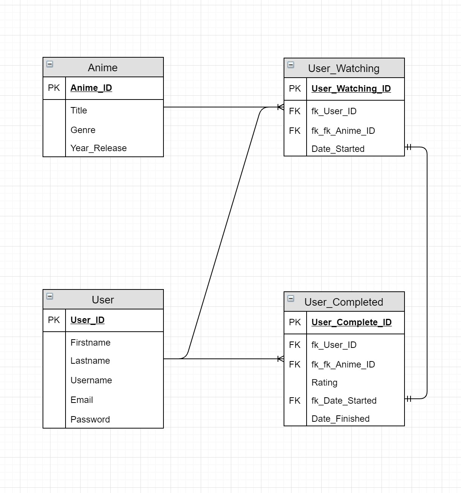
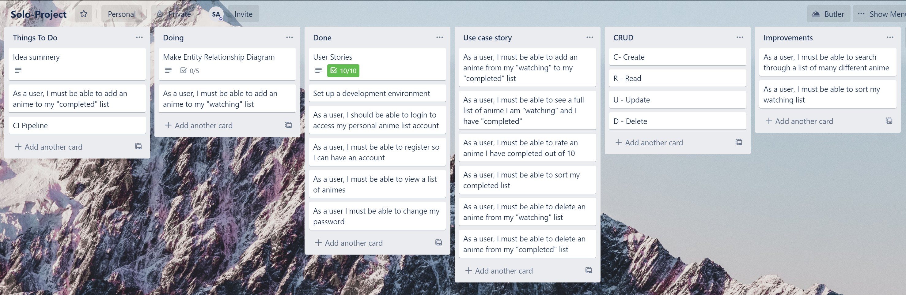
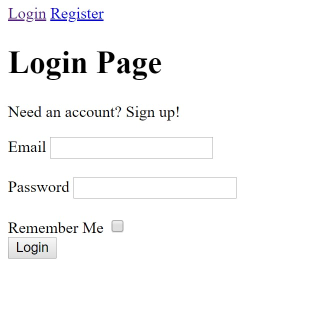
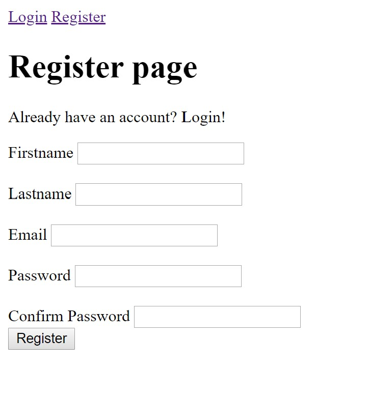
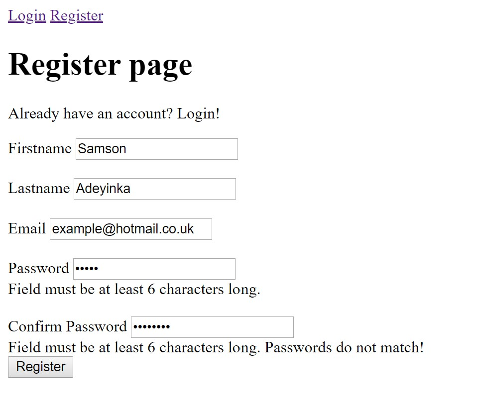
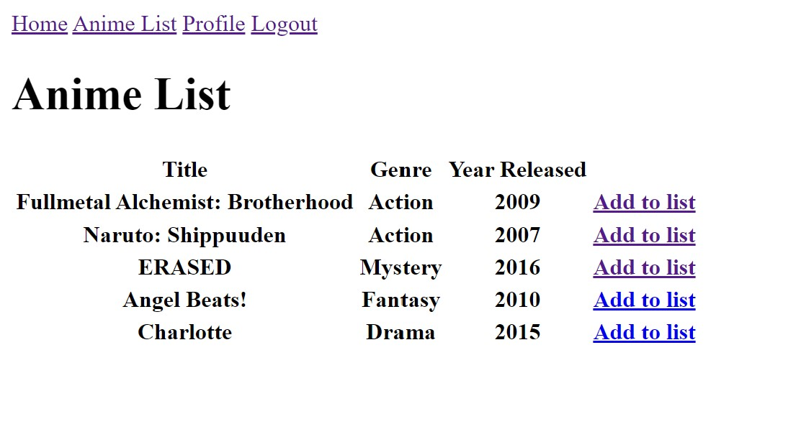
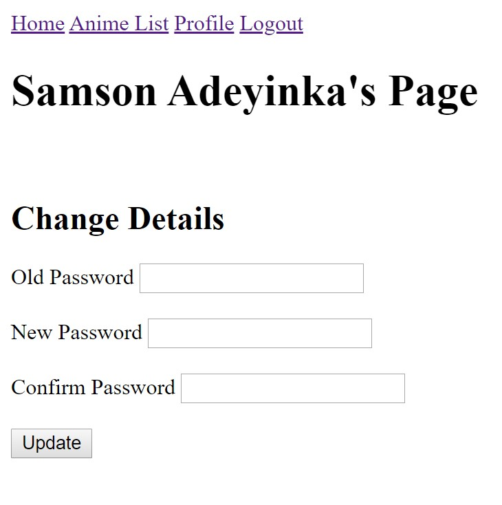
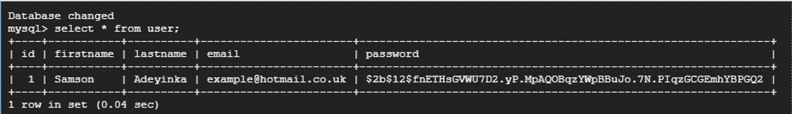
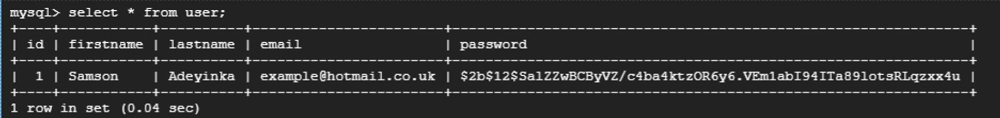

# Animelist FlaskApp

## The Idea
The Idea for this project was to create a flask application with basic CRUD fucntionality which allowed it's users to keep track of anime shows they are currently watching and anime shows they have completed.

## CI Pipeline

## Database

With the design of the database, I created 4 tables for the application: 

* User - this help infomration about the each user in the database. It consisteded of data such as the users firstname, lastname, username, email and password (which hash encrypted).
* Anime - this table held information for each anime in the database. It consisted of data such as the title, genre and the year the anime was realeased.
* Anime_Watching - this table will hold the users, the anime they are currently watching and date of when they started watching the anime.
* Anime_Complete - this is the final table within the database which hold the user, the anime they have completed and the start and finishin date of the anime.

## Planning/Tracking Progress

To help plan and keep track of the project I used a Kanban tool named Trello.
In order to keep track of what has been done and tasks which need to be started, multiple user stories were outlined. During the process of developmenet, there was also a number of notes made in order to keep track of reminders and also possible imporvements which can be made. Planning was very important to ensure my main goal was met.

## Application

This is the login page for the application, where users will use the credientials they registered with to log into their accounts

This is the register page where users will register using their name, email, a username and a password which will be stored on the database to be accessed.
With registration, there needs to be validation to ensure data input is correct.

The homepage shows a list off all Anime shows on the database and gives the user an option to add it to their watching list or completed list.

By going to through the user profile, it is possible for the user to chenage their password

## Improvements

This application is yet to be fully complete so the first course of action will be to work towards fully finishing writing this application. There are many other things which can be done to improve the experience, functionality and implementation of the app.

The second thing I will look at to improve will be to go into the codebase of the application an improve the implementation and efficiency. The most noticeable thing about this app which could clearly use some improvement is the appearance and design. This can clearly be improved using bootstrap or CSS. 

App: http://35.228.204.140:5000/ (Offline)
Trello: https://trello.com/b/t9JVLLC6/solo-project
